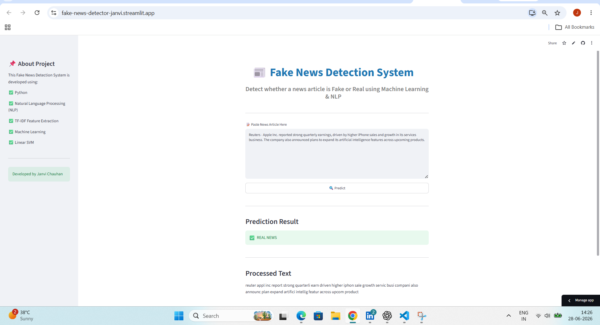

# 📰 Fake News Detection System using NLP & Machine Learning

An end-to-end **Fake News Detection System** developed using **Python, Natural Language Processing (NLP), TF-IDF Vectorization, and Machine Learning**. The system classifies news articles as **Fake** or **Real** using multiple supervised machine learning algorithms and provides real-time prediction through a **Streamlit Web Application**.

---

# 📌 Project Overview

This project demonstrates a complete Machine Learning pipeline from raw data to deployment.

### Workflow

* Dataset Loading
* Exploratory Data Analysis (EDA)
* Data Cleaning
* NLP Text Preprocessing
* TF-IDF Feature Engineering
* Model Training
* Model Comparison
* Model Evaluation
* Model Serialization
* Real-time Prediction
* Streamlit Web Application

---

# 📷 Application Preview



---

# 🚀 Features

* ✅ Fake & Real News Classification
* ✅ Data Cleaning and Text Preprocessing
* ✅ Stopword Removal & Stemming
* ✅ TF-IDF Feature Extraction
* ✅ Multiple Machine Learning Models
* ✅ Automatic Best Model Selection
* ✅ Saved Trained Model (.pkl)
* ✅ Interactive Streamlit Web App
* ✅ Modular Python Project Structure

---

# 🤖 Machine Learning Models

| Model                         | Accuracy   |
| ----------------------------- | ---------- |
| Logistic Regression           | **98.66%** |
| Multinomial Naive Bayes       | **93.26%** |
| Linear Support Vector Machine | **99.41%** |
| Random Forest Classifier ⭐    | **99.74%** |

**Best Model:** Random Forest Classifier

---

# 🛠 Technologies Used

* Python
* Pandas
* NumPy
* Scikit-learn
* NLTK
* Natural Language Processing (NLP)
* TF-IDF
* Joblib
* Streamlit
* Git
* GitHub

---

# ⚙ Installation

```bash
git clone https://github.com/janvichauhan1639-source/fake-news-detection-using-nlp.git

cd fake-news-detection-using-nlp

pip install -r requirements.txt
```

---

# ▶ Run the Project

Train Model

```bash
python train.py
```

Predict News

```bash
python predict.py
```

Run Streamlit

```bash
streamlit run app.py
```

---

# 📊 Model Evaluation

* Accuracy Score
* Precision
* Recall
* F1 Score
* Classification Report
* Model Comparison

---

# 🌐 Live Demo

https://fake-news-detector-janvi.streamlit.app

---

# 👩‍💻 Author

**Janvi Chauhan**

GitHub:
https://github.com/janvichauhan1639-source

LinkedIn:
(Add Your LinkedIn URL)

---

# ⭐ Support

If you found this project useful, please give this repository a ⭐.

---

# 📜 License

This project is licensed under the MIT License.
